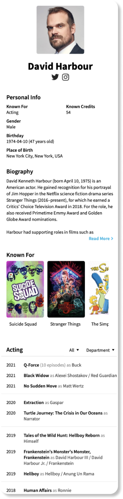

# Actor

## Tasks

- Develop actor details screen
- Separate into 4 modules

## Overview

Separate actor details screen into 4 modules:

- Header - contains avatar and social networks if exist
- Details - contains all text info about actor
- Known for - collection of movies/serials
- Filmography - timeline of filmography

## Requirements

- If the actor has social networks, open them in the corresponding applications, if there are no such applications on the device, open it in the browser
- For Filmography filters use drop down menu

[Back to Progress](../README.md#progress)