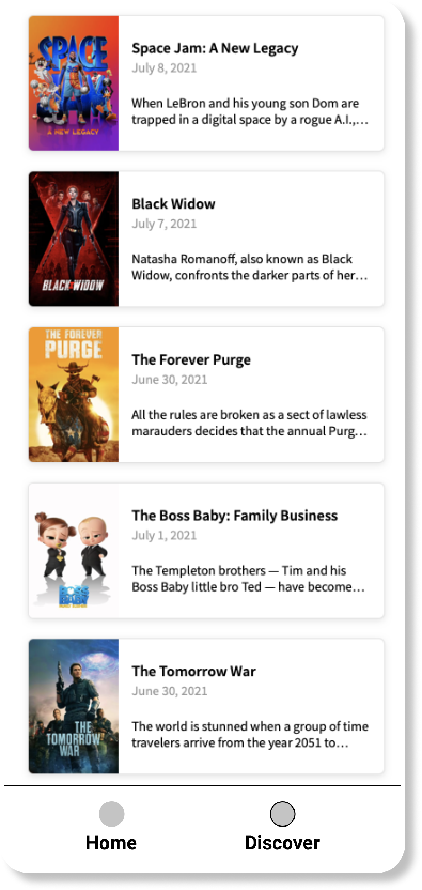

# Discover

## Tasks

- Develop discover screen
- Add tabbar
- Add pagination

## Overview

Add tab bar to the app and place a new tab called `Discover`. All previous features should place in the `Home` tab.

Use [Discover](https://developers.themoviedb.org/3/discover/movie-discover) endpoint for fetch movies. By tapping on the movie, app should opens [Movie details](./movie_details.md) screen.

## Requirements

- Try to develop pagination as smoothly as possible, ideally when the user doesn't notice the pagination process.

[Back to Progress](../README.md#progress)