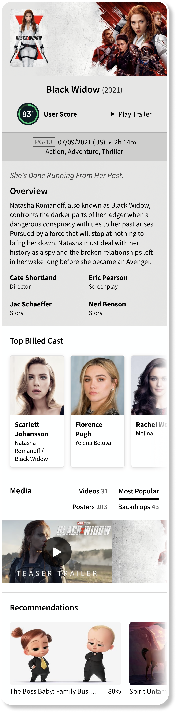

# Movie Details

## Tasks

- Decompose features
- Develop each feature as a single module

## Overview

This screen should appear when the user taps on the movie in the movie collection.

The main goal of this task is to decompose large movie details screens into small ones. Each screen (module) should be independent, it can receive models outside or can make its own API request.

## Git

Create branch `feature/movie-details` from `develop` branch. Use this branch as a super feature branch, create/merge all other decomposed features from/to this branch.

## Requirements

- Try to implement the design as accurately as possible
- Use custom font `Source Sans pro`

[Back to Progress](../README.md#progress)
