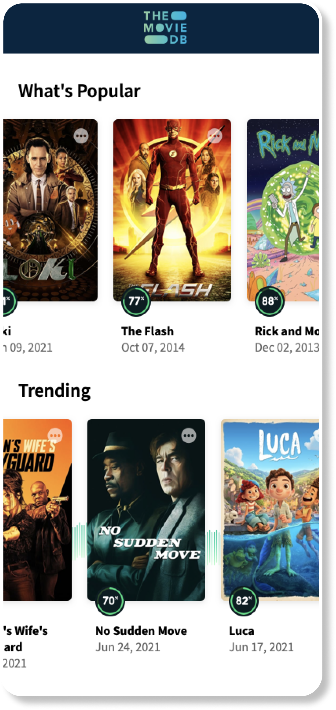

# Movies Screen

## Tasks

- Develop Movies Screen
- Mock data model
- Cache Images

## Overview

This screen shows movies collections by categories:

- Popular
- Trending
- New

Each category have 10 movies.

Each cell contains:

- Album image
- Raiting
- Title
- Release date

## Requirements

- Don't use real API, all movies should be mocked
- Download images by URL using [Lorem Picsum](https://picsum.photos)

[Back to Progress](../README.md#progress)
