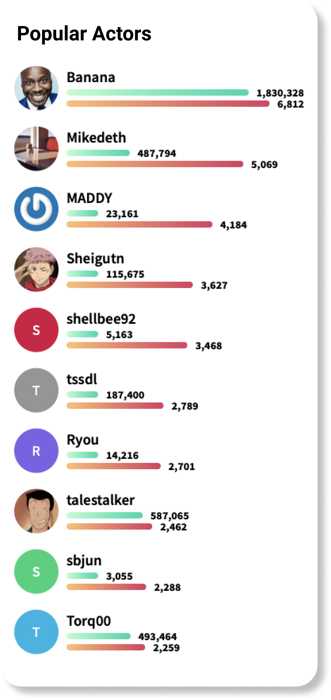

# Popular actors

## Tasks

- Develop Popular actors list
- Animate meter lines
- Use shimmer animation while loading data

## Overview

Place popular actors list at the bottom of the screen. While data loading app should show shimmer animation. Right after data loaded app should show progress animation for meter lines.

In case when user don't have avatar - draw circle with first letter of the name, with randow background color.

[Back to Progress](../README.md#progress)