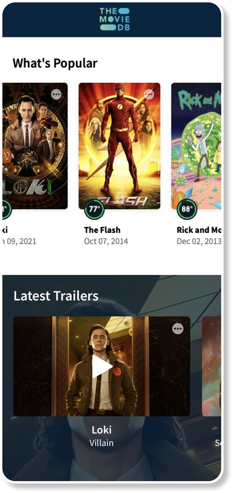

# Trailers

## Tasks

- Develop Trailers collection
- Use share dialog

## Overview

Place trailers list between movie categories:

- Popular
- Trending
- New

By tap on the trailer app should play the trailer in portrait/landscape mode.

By tap on the round button in the top right corner app should open the system share dialog, for able to share the trailer link

Background image should change when trailers swipe horizontally

## Requirements

- Use any third-party library to stream youtube videos

[Back to Progress](../README.md#progress)